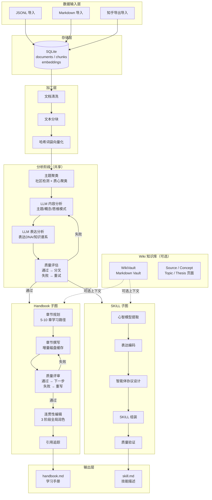

# ExpertDigest — 专家内容知识蒸馏工具

将领域专家的公开文章转化为结构化学习手册（Handbook）和技能描述文件（SKILL），实现个人知识的系统化沉淀与复用。基于 LangGraph 状态机构建，支持独立或串联运行。

---

## 架构总览



### 管线变体

| 命令 | 管线流 | 用途 |
|---|---|---|
| `generate-handbook` | 分析 → Handbook 子图 → 输出 | 仅生成学习手册 |
| `generate-skill` | 分析 → SKILL 子图 → 输出 | 仅生成技能描述 |
| 完整管线 | 分析 → Handbook → SKILL → 输出 | 同时生成两者（顺序执行） |

---

## 核心流程

### 1. 分析阶段（Analysis Phase）
所有管线变体共享的前置阶段：

```
文档加载 → 主题聚类 → LLM内容分析 → LLM表达分析 → 质量检查
                                                          │
                                                    失败 ◄┘
                                                          │
                                                    通过 → 分叉
```

- **主题聚类**：基于哈希词袋向量的社区检测 + 质心聚类，无需外部嵌入模型
- **内容分析**：LLM 提取核心主题、关键概念、思维模式、决策框架
- **表达分析**：LLM 编码作者表达风格、高频用语、确信光谱、引用习惯
- **质量检查**：评估分析质量，不通过则重试（最大 3 轮）

### 2. Handbook 子图

```
章节规划 → [撰写 → 评审]ⁿ → 连贯性编辑 → 引用追踪 → handbook.md
           ↑_____________↓
        失败则重写（仅重写未通过章节）
```

- **章节规划**：LLM 生成 5-10 章学习路径，含学习目的和主题映射
- **增量撰写**：每章写入磁盘缓存，支持断点续跑
  - 首次运行：生成全部章节
  - 重启运行：仅生成缺失或未通过章节
  - 重写模式：仅重写有评审反馈的章节
- **质量评审**：对每章节进行事实依据、结构完整性、深度、重复性检查
  - 已通过的章节跳过评审
  - 仅重写和评审未通过的章节
- **连贯性编辑**：3 阶段全局编辑
  1. 去重 + 术语统一
  2. 逻辑流优化
  3. 润色 + 引言/结语
- **引用追踪**：建立章节内容 → 原文来源的追溯表

### 3. SKILL 子图

```
心智模型提取 → 表达编码 → 协议设计 → SKILL组装 → 验证 → skill.md
```

SKILL 文件包含：
- **角色扮演规则** — AI 模仿作者语气和思维方式的规则集
- **表达 DNA** — 作者风格编码
- **智能体协议** — 问题分类 → 研究维度 → 回答框架
- **核心心智模型** — 作者反复使用的分析框架
- **决策启发式** — 经验法则
- **价值观与反模式** — 核心理念 vs 明确反对的做法
- **诚实边界** — 作者自知的知识/能力边界

### 4. 增量缓存机制

Handbook 子图实现了章节级磁盘缓存，显著增强管线韧性：

```
{output_dir}/.handbook_cache/
├── chapter_0.json    # {"title", "content", "section_count", "passed", "issues"}
├── chapter_1.json
└── ...
```

- **写入时机**：每章 LLM 生成后立即写入缓存
- **评审同步**：评审结果（passed/issues）同步写入缓存
- **恢复逻辑**：管线重启时加载缓存，仅处理缺失或未通过章节
- **覆盖策略**：重写章节后覆盖原缓存条目

---

## 声明：爬虫模块

**本仓库不包含爬虫模块。** 所有数据均来自预先爬取好的结构化文件，支持以下三种导入格式：

| 格式 | 说明 |
|---|---|
| JSONL | 每行一条 JSON 对象，含 `author`、`title`、`content`、`source` 等字段 |
| Markdown | 带 YAML 头部的 Markdown 文件 |
| 知乎导出 | 知乎爬虫工具导出的 `index/content_index.jsonl` 格式 |

如需爬取数据，请使用独立的爬虫项目（如知乎爬虫、公众号采集等），将结果导出为上述格式后再导入 ExpertDigest。

---

## 快速开始

### 1. 环境准备

```powershell
python -m venv .venv
.\.venv\Scripts\Activate.ps1
python -m pip install -e ".[dev]"
```

安装完整功能（LLM 管线）：

```powershell
python -m pip install -e ".[dev,pipeline]"
```

### 2. 配置 API Key

```powershell
cp .env.example .env
# 编辑 .env，填入你的 DeepSeek API Key
```

需要设置以下环境变量：

| 变量 | 说明 |
|---|---|
| `PIPELINE_FAST_BASE_URL` | Fast 模型 API 地址 |
| `PIPELINE_FAST_API_KEY` | Fast 模型 API 密钥 |
| `PIPELINE_FAST_MODEL` | Fast 模型名称（如 `deepseek-v4-flash`） |
| `PIPELINE_REASONING_BASE_URL` | Reasoning 模型 API 地址 |
| `PIPELINE_REASONING_API_KEY` | Reasoning 模型 API 密钥 |
| `PIPELINE_REASONING_MODEL` | Reasoning 模型名称（如 `deepseek-v4-pro`） |

### 3. 验证安装

```powershell
python -m pytest
python -c "import expert_digest; print(expert_digest.__version__)"
```

---

## CLI 命令参考

### 数据导入

```powershell
# JSONL 导入
expert-digest import-jsonl data/sample/articles.jsonl --db data/processed/expert_digest.sqlite3

# Markdown 导入
expert-digest import-markdown path/to/markdown-folder --db data/processed/expert_digest.sqlite3

# 知乎导出导入
expert-digest import-zhihu "D:\data\zhihu\export" --db data/processed/zhihu.sqlite3
```

### 数据处理

```powershell
# 文档分块
expert-digest build-chunks --db data/processed/zhihu.sqlite3

# 重建分块（清除旧分块后重建）
expert-digest rebuild-chunks --db data/processed/zhihu.sqlite3 --max-chars 1000

# 构建向量嵌入（确定性哈希词袋，无需外部模型）
expert-digest build-embeddings --db data/processed/zhihu.sqlite3

# 语义搜索
expert-digest search-chunks "搜索关键词" --db data/processed/zhihu.sqlite3 --top-k 5

# 主题聚类
expert-digest cluster-topics --db data/processed/zhihu.sqlite3 --num-topics 5
```

### Wiki 知识库

```powershell
# 构建 Wiki（基于 LLM 分析，idempotent — 自动跳过已处理文档）
expert-digest build-wiki --db data/processed/zhihu.sqlite3 --wiki-root data/wiki/huang --expert-id huang --expert-name "黄彦臻"

# Wiki 检索
expert-digest search-wiki "泡泡玛特" --wiki-root data/wiki/huang

# Wiki 评估（覆盖率、溯源性）
expert-digest eval-wiki --wiki-root data/wiki/huang --expected-source-count 824

# Wiki 检查（孤立页面、格式问题）
expert-digest lint-wiki --wiki-root data/wiki/huang
```

### 知识蒸馏（核心功能）

```powershell
# 生成学习手册（Handbook）
expert-digest generate-handbook --db data/processed/zhihu_huang.sqlite3 --author 黄彦臻 --wiki-root data/wiki/huang --output data/outputs/handbook.md

# 生成技能描述（SKILL）
expert-digest generate-skill --db data/processed/zhihu_huang.sqlite3 --author 黄彦臻 --wiki-root data/wiki/huang --output data/outputs/skill.md
```

### 其他

```powershell
# 列出文档
expert-digest list-documents --author 黄彦臻 --db data/processed/zhihu.sqlite3
```

---

## 项目结构

```
expert-digest/
├── src/expert_digest/
│   ├── cli.py                          # 命令行入口（664 行，20+ 子命令）
│   ├── config.py                       # 路径配置
│   │
│   ├── domain/models.py                # 核心数据模型（Document, Chunk, Span）
│   │
│   ├── ingest/                         # 数据导入
│   │   ├── jsonl_loader.py             #   JSONL 解析
│   │   ├── markdown_loader.py          #   Markdown + YAML 头部解析
│   │   └── zhihu_loader.py             #   知乎导出结构解析
│   │
│   ├── processing/                     # 数据加工
│   │   ├── cleaner.py                  #   文档清洗（去噪、标准化）
│   │   ├── splitter.py                 #   文本分块（滑动窗口）
│   │   └── embedder.py                 #   哈希词袋向量化（确定性）
│   │
│   ├── storage/sqlite_store.py         # SQLite 持久化层（5 张表，409 行）
│   │
│   ├── retrieval/retriever.py          # 余弦相似度语义检索
│   │
│   ├── knowledge/                      # 知识分析
│   │   ├── community_detection.py      #   社区检测算法
│   │   ├── topic_clusterer.py          #   主题聚类（376 行，核心算法）
│   │   ├── topic_graph.py              #   主题关系图
│   │   └── topic_report.py             #   聚类质量报告
│   │
│   ├── generation/llm_client.py        # Anthropic 兼容 HTTP 客户端
│   │                                   #   （重试、空响应恢复、网络容错）
│   │
│   ├── wiki/                           # Markdown Wiki 知识库
│   │   ├── vault.py                    #   WikiVault 文件系统抽象
│   │   ├── models.py                   #   页面模型（source/concept/topic/thesis）
│   │   ├── frontmatter.py              #   YAML 头部解析/渲染
│   │   ├── writer.py                   #   LLM 分析结果写入（329 行）
│   │   ├── analyzer.py                 #   文档级 LLM 分析
│   │   ├── retriever.py                #   Wiki 内部检索
│   │   ├── evaluator.py                #   覆盖率和溯源性评估
│   │   └── linter.py                   #   孤立页面和格式检查
│   │
│   ├── pipeline/                       # LangGraph 蒸馏管线
│   │   ├── graph.py                    #   主图编排（186 行）
│   │   ├── state.py                    #   管线状态定义（DigestState）
│   │   ├── llm.py                      #   LLM 客户端工厂
│   │   │
│   │   ├── nodes/                      #   分析阶段节点
│   │   │   ├── loader.py               #     数据加载
│   │   │   ├── clusterer.py            #     主题聚类
│   │   │   ├── analyzer.py             #     LLM 内容分析
│   │   │   ├── expression.py           #     LLM 表达分析
│   │   │   └── quality.py              #     质量评估 + 重试路由
│   │   │
│   │   ├── handbook/                   # Handbook 子图
│   │   │   ├── graph.py               #     子图编排（含重写循环）
│   │   │   ├── planner.py             #     章节规划（LLM 大纲生成）
│   │   │   ├── writer.py              #     章节撰写（增量缓存，340 行）
│   │   │   ├── reviewer.py            #     质量评审（选择性重评审）
│   │   │   ├── editor.py              #     3 阶段连贯性编辑
│   │   │   └── tracer.py              #     证据引用追溯
│   │   │
│   │   └── skill/                      # SKILL 子图
│   │       ├── graph.py               #     子图编排
│   │       ├── thinker.py             #     心智模型提取
│   │       ├── expresser.py           #     表达风格编码
│   │       ├── protocol.py            #     智能体协议设计
│   │       ├── builder.py             #     SKILL.md 组装
│   │       └── verifier.py            #     质量验证
│   │
│   └── ...                             # （无额外依赖模块）
│
├── tests/                              # pytest 测试套件（30 个文件）
│   ├── test_cli.py                     #   CLI 集成测试
│   ├── test_cli_wiki.py                #   Wiki CLI 测试
│   ├── test_pipeline_handbook.py       #   Handbook 管线测试
│   ├── test_pipeline_skill.py          #   SKILL 管线测试
│   ├── test_pipeline_graph.py          #   主图编排测试
│   ├── test_wiki_*.py                  #   Wiki 模块测试（8 个文件）
│   └── ...                             #   其他模块单元测试
│
├── configs/                            # 配置文件
│   ├── default.yaml
│   ├── handbook_topic_taxonomy.json
│   └── prompts.yaml
│
├── scripts/                            # 辅助脚本
│   ├── quickstart_selfcheck.ps1        #   自动化验证脚本
│   └── run_streamlit.ps1
│
├── data/                               # 运行时数据
│   ├── sample/                         #   示例数据（30 条测试文章）
│   ├── processed/                      #   SQLite 数据库（gitignored）
│   ├── outputs/                        #   生成产物 handbook.md（gitignored）
│   └── wiki/                           #   Wiki Vault（gitignored）
│
├── .env.example                        # 环境变量模板
├── pyproject.toml                      # 项目配置
└── README.md
```

---

## 输入数据格式

### JSONL

```json
{"author":"黄彦臻","title":"标题","content":"正文...","source":"zhihu:answer:123","url":"https://...","created_at":"2026-04-03T07:55:11.000Z"}
```

必填字段：`author`、`title`、`content`、`source`
可选字段：`url`、`created_at`

### Markdown

```markdown
---
author: 黄彦臻
title: 标题
url: https://...
created_at: 2026-04-03T07:55:11.000Z
---

正文内容。
```

---

## 技术栈

| 类别 | 技术 |
|---|---|
| **运行环境** | Python 3.11+ |
| **管线编排** | LangGraph（StateGraph 状态机） |
| **LLM API** | DeepSeek / Anthropic 兼容接口，分 fast / reasoning 两个档位 |
| **向量化** | 确定性哈希词袋（Bag-of-Words），无需外部嵌入模型 |
| **持久化** | SQLite（5 张表：documents、chunks、embeddings、spans、evidence） |
| **Wiki** | Markdown Vault 文件系统，YAML 前页元数据 |
| **测试** | pytest（30 个测试文件，200+ 测试用例） |
| **代码检查** | ruff |

### 外部依赖

| 分组 | 依赖 | 用途 |
|---|---|---|
| 核心 | 零依赖 | 导入、存储、检索、知识分析均无外部依赖 |
| `[pipeline]` | langgraph | LLM 驱动管线编排 |
| `[dev]` | pytest, ruff | 测试和代码质量 |

---

## 完整工作流示例

从零开始到生成 Handbook + SKILL 的一站式流程：

```powershell
# 1. 导入数据
expert-digest import-jsonl data/sample/articles.jsonl --db data/processed/expert_digest.sqlite3

# 2. 构建分块和向量
expert-digest build-chunks --db data/processed/expert_digest.sqlite3
expert-digest build-embeddings --db data/processed/expert_digest.sqlite3

# 3. 生成学习手册
expert-digest generate-handbook --db data/processed/expert_digest.sqlite3 --author "作者名"

# 4. 生成技能描述
expert-digest generate-skill --db data/processed/expert_digest.sqlite3 --author "作者名"

# 5. 查看结果
cat data/outputs/handbook.md
cat data/outputs/skill.md
```

自动化验证：

```powershell
.\scripts\quickstart_selfcheck.ps1
```

---

## 开发

```powershell
# 运行测试
python -m pytest

# 代码检查
python -m ruff check .

# 安装开发依赖
python -m pip install -e ".[dev]"
```

---

## 许可

本项目采用 MIT 许可证。
